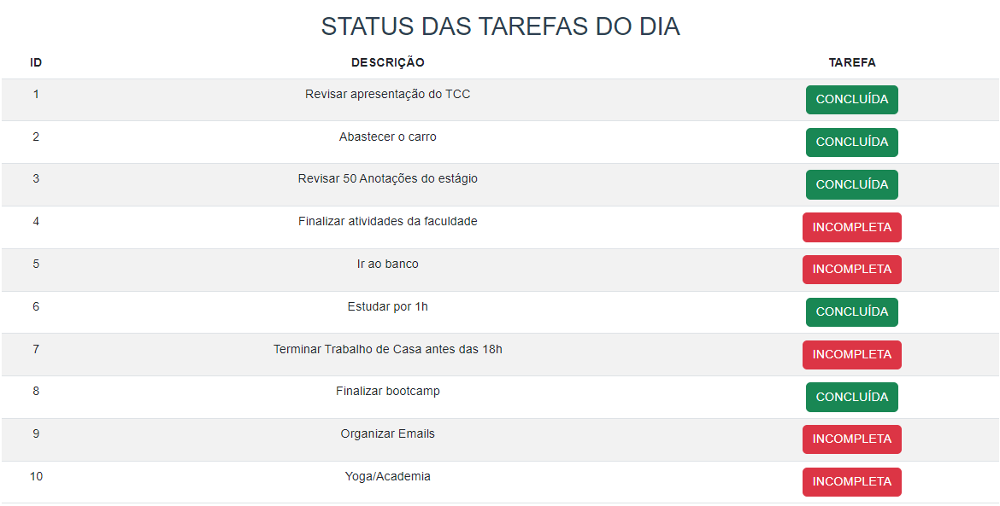

# 

        Este repositório contém exercícios que estão sob avaliação, referentes ao TP'S (1, 3)
        e Assessment de Frameworks Vue e React.
- [x] [Teste Prático 1](https://github.com/gabybonini/TP01-Vue-/tree/main/src)

- [x] [Teste Prático 3](https://github.com/gabybonini/TP03-Vue/tree/main/src)

- [ ] Assessment
## Questão 10 - TP1

Crie um novo projeto Web Vue.js com os comandos aprendidos e implemente as seguintes funcionalidades:

Crie uma variável do tipo Array com o objeto que será uma tarefa, que vai possuir as propriedades: id (Number), descricao (String), estaCompleta (Boolean);
Preencha esse array com várias tarefas e as propriedades acima;
Exiba uma lista com essas tarefas exibindo a descrição;
Implemente um elemento de interface para a tarefa que possuir a variável estaCompleta como True. Sugestões de elemento de interface: Texto sublinhado, Texto riscado, Cor diferente, etc;



### Aluna: Gabriellaine Araujo Bonini - Noite - 22.3T

******

## Project setup
```
npm install
```

### Compiles and hot-reloads for development
```
npm run serve
```

### Compiles and minifies for production
```
npm run build
```

### Lints and fixes files
```
npm run lint
```

### Customize configuration
See [Configuration Reference](https://cli.vuejs.org/config/).
